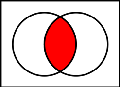
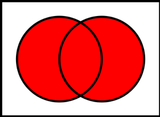
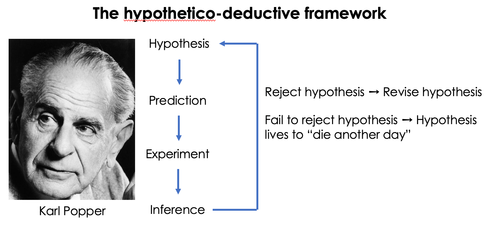

Week 1 Lecture
========================================================

Reading Material
---------------------

- Text
    + Foundational and Applied Statistics for Biologists Using R
    + Biostatistical Design and Analysis Using R

- Papers from primary literature

Basic Outline
------------------------

First half: 
- R
- bootstrap, jackknife, and other randomization techniques
- hypothesis testing
- probability distributions 
- the “classic tests” of statistics
- graphical analysis of data 

Second half:

- regression (incl. ANOVA, ANCOVA)
- model building 
- model criticism 
- non-linear regression 
- multivariate regression

Grading:

- 12 Problem sets (3% each, 36% total)

- 2 Quizzes (2% each, 4% total)

- Midterm (25%)

- Final (35%)

Class Structure

- Lecture on Tuesday

- "Lab"" on Thursday

- Problem sets are posted on Wednesdays (feel free to remind me via Slack if I forget), and are due before lecture next Tuesday. This deadline is very strict, no exceptions. Turn in what you have before 8:00 am on Tuesday, even if its not complete. 

Communication

- Use slack! 

- Come to (both) office hours

- E-mail me
    + Weekdays 9 am - 10 pm
    + Sundays 8 pm - 10 pm
  

Today's Agenda
--------------------

1. Basic probability theory
2. An overview of univariate distributions
3. Calculating the expected value of a random variable
4. A brief introduction to the Scientific Method
5. Introduction to statistical inference

## Basic Probability Theory

Let's imagine that we have a bag with a mix of regular and peanut M&Ms. Each M&M has two traits: Color and Type.

$$ \sum_{all \: colors} P(color) = 1 $$
$$ \sum_{all \: types} P(types) = ? $$

### Intersection

(\#fig:unnamed-chunk-1)Red shading represents the intersection. Source: Wikimedia Commons

Now let's pull one M&M out of the bag. *If* the color distribution of chocolate M&Ms and peanut M&Ms is the same, then these two traits are independent, and we can write the probability of being *both* Green and Peanut as  

$$ P(Green \: AND \:  Peanut) = P(Green \cap Peanut) = P(Green) \cdot P(Peanut) $$

This is called a Joint Probability and we usually write it as $P(Green,Peanut)$. *This only works if these two traits are independent of one another.* If color and type were not independent of one another, we would have to calculate the joint probability differently, but in the vast majority of cases we are working with data that we assuming are independent of one another. In these cases, the joint probability is simply the product of all the individual probabilities.

### Union

(\#fig:unnamed-chunk-2)Red shading represents the union. Source: Wikimedia Commons

 

$$ \begin{align*} 
P(Green \: OR \: Peanut) &= P(Green \cup Peanut) \\ 
&= P(Green) + P(Peanut) - P(Green \cap Peanut) \end{align*} $$ 

**Question: Why do we have to subtract off the intersection?**

  
Click for Answer

    If we do not subtract off the intersection, then the probability of Green AND Peanut will be double counted.

 

### Complement:

The complement of a trait represents everything that does *not* have that trait.

(\#fig:unnamed-chunk-3)Red shading represents the complement. Source: Wikimedia Commons

$$ P(Green^c) = 1 - P(Green)  $$

## Multiple events

Let's consider what happens when we pull 2 M&Ms out of the bag

$$ P (Green \: AND \: THEN \: Blue) = P(Green) \cdot P(Blue) $$

**Question: What if we didn't care about the order?**

  
Click for Answer

    If we do not care about the order, then the combination of one Green M&M and one Blue M&M could have come about because we drew a Blue M&M and then a Green, or a Green and then a Blue. Because there are two ways to get this outcome (and they are mutually exclusive, so we can simply add the two probabilities), the total probability is simply 2 $\times$ P(Green) $\times$ P(Blue).

 

## Conditionals

$$ P(A \mid B) = P(A \: conditional \: on \: B) $$

$$ \begin{align*}  P(A,B) = P(A \cap B) &= P(A \mid B) \cdot P(B) \\
&= P(B \mid A) \cdot P(A) \end{align*} $$

## Bayes Theorem

$$ P(A \mid B) \cdot P(B) = P(B \mid A) \cdot P(A) $$

$$ P(A \mid B) = \frac{P(B \mid A) \cdot P(A)}{P(B)}$$

In Bayesian analyses (which we will not get into this semester), we are using this to calculate the probability of certain model parameters conditional on the data you have. But to find out more, you'll have to take BEE 569.

$$ P(parameters \mid data) \cdot P(data) = P(data \mid parameters) \cdot P(parameters) $$

$$ P(parameters \mid data) = \frac{P(data \mid parameters) \cdot P(parameters)}{P(data)}$$

## A few foundational ideas

There are a few statistics (a *statistic* is just something calculated from data) that we will need to know right at the beginning.

For illustration purposes, lets assume we have the following (sorted) series of data points: (1,3,3,4,7,8,13)

There are three statistics relating the "central tendancy": the *mean* (the average value; 5.57), the *mode* (the most common value; 3), and the *median* (the "middle" value; 4). We often denote the mean of a variable with a bar, as in $\bar{x}$. There are also two statistics relating to how much variation there is in the data. The *variance* measures the average squared distance between each point and the mean. For reasons that we will discuss in lab, we estimate the variance using the following formula

$$
\mbox{variance}_{unbiased} = \frac{1}{n-1}\sum_{i=1}^{n}(x_{i}-\bar{x})^{2}
$$
rather than the more intuitive

$$
\mbox{variance}_{biased} = \frac{1}{n}\sum_{i=1}^{n}(x_{i}-\bar{x})^{2}
$$

Keep in mind that variance measures a distance *squared*. So if your data represent heights in m, than the variance will have units $m^{2}$ or square-meters.

The *standard deviation* is simply the square-root of variance, and is often denoted by the symbol $\sigma$.

$$
\sigma = \sqrt{\frac{1}{n-1}\sum_{i=1}^{n}(x_{i}-\bar{x})^{2}}
$$

If you were handed a distribution and you were asked to measure a characteristic "fatness" for the distribution, your estimate would be approximately $\sigma$. Note that $\sigma$ has the same units as the original data, so if your data were in meters, $\sigma$ would also be in meters.

We won't get to Normal distributions properly until Week 3, but we will need one fact about the "Standard Normal Distribution" now. The Standard Normal distribution is a Normal (or Gaussian, bell-shaped) distribution with mean equal to zero and standard deviation equal to 1. 68$\%$ of the probability is contained within 1 standard deviation of the mean (so from -$\sigma$ to +$\sigma$), and 95$\%$ of the probability is contained within 2 standard deviations of the mean (so from -2$\sigma$ to +2$\sigma$). (Actually, 95$\%$ is contained with 1.96 standard deviations, so sometimes we will use the more precise 1.96 and sometimes you will see this rounded to 2.)

Overview of Univariate Distributions 
--------------------------------

Discrete Distributions

- Binomial

- Multinomial

- Poisson

- Geometric

Continuous Distributions

- Normal/Gaussian

- Beta

- Gamma

- Student's t

- $\chi^2$

What can you ask of a distribution?
--------------------------------

- **Probability Density Function**: $P(x_1<X<x_2)$ (continuous distributions)

    **Stop: Let's pause for a second and discuss the probability density function. This is a concdept that student's often struggle with. What is the interpretation of $P(x)$? What is $P(x=3)$? Can $P(x)$ ever be negative? [No.] Can $P(x)$ ever be greater than 1? [Yes! Why?]**

- **Probability Mass Function**: $P(X=x_1)$ (discrete distributions)

- **Cumulative Density Function (CDF)**: What is $P(X \le X^*)$?

- **Quantiles of the distributions**: What is $X^{*}$ if $P(X \le X^{*})=0.37$?

- **Sample from the distribution**: With a large enough sample, the histogram will come very close to the underlying PDF.

Note that the CDF is the integration of the PDF, and the PDF is the derivative of the CDF, so if you have one of these you can always get the other. Likewise, you can always get from the quantiles to the CDF (and then to the PDF). These three things are all equally informative about the shape of the distribution.

### Expected Value of a Random Variable

In probability theory the expected value of a random variable is the weighted average of all possible values that this random variable can take on. The weights used in computing this average correspond to the probabilities in case of a discrete random variable, or densities in case of continious random variable.

### Discrete Case

$$ X = \{X_1, X_2,...,X_k\} \\
E[X] = \sum_{i=1}^n{X_i \cdot P(X_i)}$$

- Example: Draw numbered balls with numbers 1, 2, 3, 4 and 5 with probabilities 0.1, 0.1, 0.1, 0.1, 0.6.

$$ \begin{align*} E[X] &= (0.1 \cdot 1) + (0.1 \cdot 2) + (0.1 \cdot 3) + (0.1 \cdot 4) + (0.6 \cdot 5) \\ &=4 \end{align*}$$

### Continuous Case

$$ E[X] = \int_{-\infty}^{\infty}{X \cdot f(X)dX}$$

Note that the function $f(x)$ in the above equation is the probability density function.

## A Brief Introduction to Scientific Method 

INDUCTIVE reasoning:

A set of specific observations $\rightarrow$ A general principle

Example: I observe a number of elephants and they were all gray. Therefore, all elephants are gray.

DEDUCTIVE reasoning:

A general principle $\rightarrow$ A set of predictions or explanations

Example: All elephants are gray. Therefore, I predict that this new (as yet undiscovered) species of elephant will be gray.

QUESTION: If this new species of elephant is green, what does this do to our hypothesis that all elephants are gray?

Some terminology:

**Null Hypothesis**: A statement encapsulating "no effect"

**Alternative Hypothesis**: A statement encapsulating "an effect""

- Fisher: Null hypothesis only

- Neyman and Pearson: H0 and H1, Weigh risk of of false positive against the false negative

- We use a hyprid approach

(\#fig:unnamed-chunk-4)Hypothetico-deductive view of the scientific method. Photo Source: LSE Library

Not all hypotheses are created equal. Consider the following two hypotheses:

H$_{1}$: There are vultures in the local park

H$_{2}$: There are no vultures in the local park

Which of these two ways of framing the null hypothesis can be rejected by data?

**Hypothesis can only be rejected, they can never be accepted!**

\ 

"Based on the data obtained, we reject the null hypothesis that..."

\ or

"Based on the data obained, we fail to reject the null hypothesis that..."

More terminology

**Population**: Entire collection of individuals a researcher is interested in.

**Model**: Mathematical description of the quantity of interest. It combines a general description (functional form) with parameters (population parameters) that take specific values.

**Population paramater**: Some measure of a population (mean, standard deviation, range, etc.). Because populations are typically very large this quantity is unknown (and usually unknowable).

**Sample**: A subset of the population selected for the purposes of making inference for the popualtion.

**Sample Statistic**: Some measure of this sample that is used to infer the true value of the associated populatipn parameter.

An example:

**Population**: Fish density in a lake

**Sample**: You do 30 net tows and count all the fish in each tow

**Model**: $Y_i \sim Binom(p,N)$

The basic outline of statistical inference

sample(data) $\rightarrow$ sample statistics $\rightarrow$ ESTIMATOR $\rightarrow$ population parameter $\rightarrow$ underlying distribution

Estimators are imperfect tools

- Bias: The expected value $\neq$ population parameter

- Not consistent: As $n \to \infty$ sample statistic $\neq$ population parameter

- Variance

