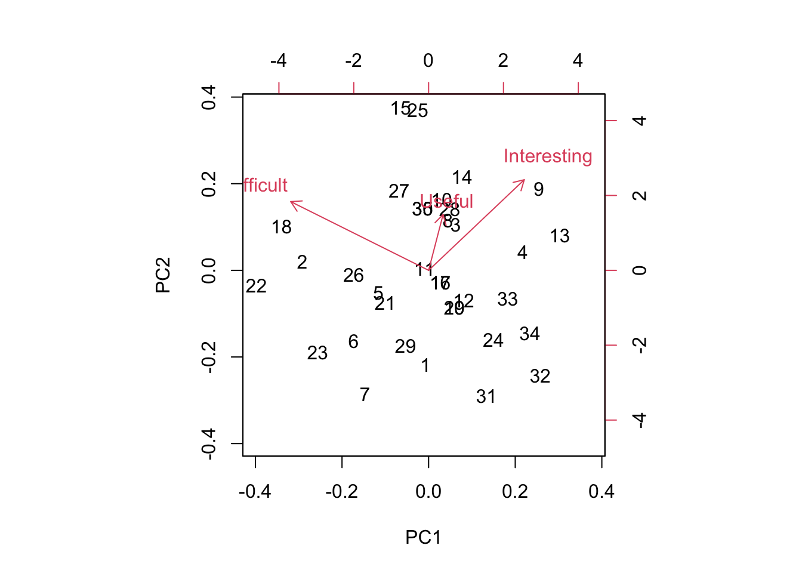

Week 14 Lab
=============

In lab we'll go through 

1. Some practice with PCA using the semester survey results

2. Some practice with GLMs using the semester survey results

There are a number of functions you could use in R to do principal components analysis. We will use the 'prcomp' function, but there is a very closely related function called 'princomp' as well as a function called 'principal' which is in the 'psych' package.


```r
readings<-read.csv("~/Dropbox/Biometry/Week 14 Multivariate analyses and Review/Week 14 Lab/Readings 2021.csv",header=T)

missing<-which(is.na(readings$Useful)|is.na(readings$Difficult)|is.na(readings$Interesting))
Useful<-aggregate(readings$Useful[-missing], by=list(Index=readings$Index[-missing]),FUN=mean)$x

Difficult<-aggregate(readings$Difficult[-missing], by=list(Index=readings$Index[-missing]),FUN=mean)$x

Interesting<-aggregate(readings$Interesting[-missing], by=list(Index=readings$Index[-missing]),FUN=mean)$x

Length.means.readings<-aggregate(readings$Length[-missing], by=list(Index=readings$Index[-missing]),FUN=mean)$x

pca.result<-prcomp(~Useful+Interesting+Difficult,retx=T)
```

Before printing out the result, let's make sure everyone understands what I was doing with the aggregate commands, and how the 'prcomp' function input works. 

To print out a summary of the PCA, we use


```r
summary(pca.result)
```

```
## Importance of components:
##                           PC1    PC2    PC3
## Standard deviation     0.9084 0.5395 0.3891
## Proportion of Variance 0.6510 0.2296 0.1194
## Cumulative Proportion  0.6510 0.8806 1.0000
```

We see that PCA1 is associated with over 65% of the variation in responses. So, what is PCA1?


```r
pca.result$rotation
```

```
##                    PC1       PC2        PC3
## Useful      -0.1571361 0.7179282  0.6781500
## Interesting -0.6425818 0.4471147 -0.6222356
## Difficult    0.7499312 0.5335425 -0.3910697
```

PCA1 is an axis which describes papers that are Less Interesting and More Difficult, with a very small weight towards papers that are Less Useful. In other words, a large positive PCA1 score would be associated with an boring paper that was difficult to read. Note that the principal components denote an axis, but the direction is arbitrary. Since no direction is implied by the sign, we do not interpret this as saying that most papers were boring and difficult. Instead we would say that the papers largely fall along a common axis in which Interesting/Easy/Useful papers are at one end, and Boring/Difficult/Useless papers are at the other end. 

We can visualize this using the function 'biplot'


```r
biplot(pca.result)
```



Biplots take some getting used to, and when they have many more dimensions, they become increasingly difficult to interpret. However, papers low on PC1 are generally Interesting and Easy and paper high on PC1 are generally Boring and Difficult. Papers low on PC2 are generally Boring and Easy and Useless and papers high on PC2 are generally Interesting and Difficult and Useful.

So which papers came out as highly positive on the PC2 axis? Remember, these are considered Useful and Interesting but also Difficult to read.


```r
readings[readings$Index==14,1][1]
```

```
## [1] "Shmueli (2010) To explain or predict? Statistical Science 25(3): 289-310."
```

Perhaps not surprising! 

You can play around with this yourself and see why I added the [1] at the end. When I pull out the rows with the Index identified by the PCA, I get the list of all entries (since we had >1 team rating the papers) and so I only print the first one.

Which papers were highly positive on PC1? (Difficult and Boring)


```r
readings[readings$Index==2,1][1]
```

```
## [1] "Bolker Chapter 6 (Posted on Bb)"
```

Alas, poor Bolker! Bolker is often rated as boring and difficult. I keep him around because his thinking is so "spot on" and perhaps his style is an aquired taste.

These two papers are the only two stand outs this year. The other readings cluster together.

One thing to keep in mind is that a PCA identifies *variation* in the dataset. It's worth putting these numbers in context of the overall means.


```r
mean(Useful)
```

```
## [1] 3.288542
```

```r
mean(Difficult)
```

```
## [1] 2.421354
```

```r
mean(Interesting)
```

```
## [1] 3.223438
```

So the average reading scored pretty high for being Useful and Interesting and was rated of medium Difficulty.

We can do the same for the problem sets:


```r
PS<-read.csv("~/Dropbox/Biometry/Week 14 Multivariate analyses and Review/Week 14 Lab/ProblemSets 2021.csv",header=T)

# In this case there were no missing data
Useful.means.PS<-aggregate(PS$Useful, by=list(Index=PS$Week),FUN=mean)$x

Difficult.means.PS<-aggregate(PS$Difficult, by=list(Week=PS$Week),FUN=mean)$x

Interesting.means.PS<-aggregate(PS$Interesting, by=list(Week=PS$Week),FUN=mean)$x

pca.result<-prcomp(~Useful.means.PS+Interesting.means.PS+Difficult.means.PS,data=PS,retx=T)
```

Notice that it has simply labeled them in order, so 7=Week #9 PS, 8=Week #10 PS, 9=Week #11 PS, 10=Week #12 PS, and 11=Week #13 PS.

To print out a summary of the PCA, we use


```r
summary(pca.result)
```

```
## Importance of components:
##                           PC1    PC2     PC3
## Standard deviation     0.8288 0.7171 0.33638
## Proportion of Variance 0.5226 0.3913 0.08609
## Cumulative Proportion  0.5226 0.9139 1.00000
```

We see that for the problem sets, PC1 is even more dominant (83% of the variation). So, what is PCA1?


```r
pca.result$rotation
```

```
##                             PC1        PC2        PC3
## Useful.means.PS      -0.5926091 -0.1695284  0.7874482
## Interesting.means.PS -0.5122508 -0.6751269 -0.5308510
## Difficult.means.PS    0.6216217 -0.7179581  0.3132453
```

PC1 almost evenly combines all three factors, and the axis divides problem sets judged Useless/Boring/Difficult and those that are Useful/Interesting/Easy. (Reminder: the signs of the PCs is arbitrary, so the signs on the rotation could have all be flipped.) Looking across all the PC axes, we want papers that are low (negative) on PC1, low (negative) on PC2, and probably high (positive) on PC3.


```r
biplot(pca.result)
```


Most of this is a scatter, but the problem set for Week 1 stands out in the upper right. Looking at the data, this is largely because the Week 1 problem set was the least interesting of all the problem sets.

Again, looking at the means:


```r
mean(Useful.means.PS)
```

```
## [1] 3.827273
```

```r
mean(Difficult.means.PS)
```

```
## [1] 3.118182
```

```r
mean(Interesting.means.PS)
```

```
## [1] 3.263636
```

The problem sets overall rated as being Useful, and Interesting, and Difficult. 

Missing at random - practice with GLMs
--------------------------------------

There were missing data for some of the readings. One could ask the question, are these data missing at random? In the problem set for Week #13, we completed the dataset using random imputation. In other words, we assumed that data were missing at random and we drew with replacement from the other values to replace missing datapoints. However, in this case, it seems likely that data are not missing at random. I suspect that papers were not evaluated because no one read them, and that something about the papers may predict whether the papers were read or not. We can answer this question by constructing a model for "missingness" which assumes that the probability of being evaluated is distributed as Binom(n,p) where p is the probability of being evaluated (and presumably, of having been read in the first place).

First, I need to go through the data and figure out how many times a paper was evaluated. 


```r
num.missing<-vector(length=max(readings$Index))
for (i in 1:max(readings$Index))
{
  num.missing.useful<-sum(as.numeric(is.na(readings$Useful[readings$Index==i])))
  num.missing.difficult<-sum(as.numeric(is.na(readings$Difficult[readings$Index==i])))
  num.missing.interesting<-sum(as.numeric(is.na(readings$Interesting[readings$Index==i])))
  max.missing<-max(num.missing.useful,num.missing.difficult,num.missing.interesting)
  num.missing[i]<-max.missing
}
```

For simplicity, I am considering "evaluated" as evaluated for all three categories (Useful, Difficult, and Interesting).

Now I use a Binomial GLM to model the probability of being evaluated as a function of Useful, Interesting, and Difficult (as rated by the other groups). Note that there were 5 groups total, so n=5.


```r
fit<-glm(cbind(5-num.missing,num.missing)~Useful+Difficult+Interesting,family="binomial")
summary(fit)
```

```
## 
## Call:
## glm(formula = cbind(5 - num.missing, num.missing) ~ Useful + 
##     Difficult + Interesting, family = "binomial")
## 
## Deviance Residuals: 
##     Min       1Q   Median       3Q      Max  
## -2.6523   0.2319   0.8001   1.0451   1.4609  
## 
## Coefficients:
##             Estimate Std. Error z value Pr(>|z|)  
## (Intercept) -1.15040    2.82422  -0.407    0.684  
## Useful       1.09309    0.64480   1.695    0.090 .
## Difficult    0.04547    0.45650   0.100    0.921  
## Interesting -0.05625    0.51023  -0.110    0.912  
## ---
## Signif. codes:  0 '***' 0.001 '**' 0.01 '*' 0.05 '.' 0.1 ' ' 1
## 
## (Dispersion parameter for binomial family taken to be 1)
## 
##     Null deviance: 49.173  on 31  degrees of freedom
## Residual deviance: 45.877  on 28  degrees of freedom
## AIC: 70.197
## 
## Number of Fisher Scoring iterations: 5
```

None of the covariates are significant, which isn't a surprise. Because I (accidentally) didn't pass out the Week 14 readings until Monday night, it was only the Week 14 readings that had many NAs, so we would not expect (except possibly by chance) any association with the factors of Useful, Difficult, or Interesting. 

We might suspect a high degree of multicollinearity among the predictors. We can use PCA to create new orthogonal covariates which (more efficiently) capture the variability in the survey results. 

I will rerun the PCA for the readings.


```r
pca.result<-prcomp(~Useful+Interesting+Difficult,retx=T)
summary(pca.result)
```

```
## Importance of components:
##                           PC1    PC2    PC3
## Standard deviation     0.9084 0.5395 0.3891
## Proportion of Variance 0.6510 0.2296 0.1194
## Cumulative Proportion  0.6510 0.8806 1.0000
```

```r
pca.result$rotation
```

```
##                    PC1       PC2        PC3
## Useful      -0.1571361 0.7179282  0.6781500
## Interesting -0.6425818 0.4471147 -0.6222356
## Difficult    0.7499312 0.5335425 -0.3910697
```

PCA1 captures about 91% of the variability, so we try using just PCA1 in our GLM. 


```r
fit<-glm(cbind(5-num.missing,num.missing)~pca.result$x[,1],family="binomial")
summary(fit)
```

```
## 
## Call:
## glm(formula = cbind(5 - num.missing, num.missing) ~ pca.result$x[, 
##     1], family = "binomial")
## 
## Deviance Residuals: 
##     Min       1Q   Median       3Q      Max  
## -2.7500   0.5157   0.9595   1.0049   1.1519  
## 
## Coefficients:
##                   Estimate Std. Error z value Pr(>|z|)    
## (Intercept)         2.2729     0.2723   8.349   <2e-16 ***
## pca.result$x[, 1]  -0.1135     0.2932  -0.387    0.699    
## ---
## Signif. codes:  0 '***' 0.001 '**' 0.01 '*' 0.05 '.' 0.1 ' ' 1
## 
## (Dispersion parameter for binomial family taken to be 1)
## 
##     Null deviance: 49.173  on 31  degrees of freedom
## Residual deviance: 49.026  on 30  degrees of freedom
## AIC: 69.346
## 
## Number of Fisher Scoring iterations: 5
```

Still not significant.


```r
fit<-glm(cbind(5-num.missing,num.missing)~Length.means.readings,family="binomial")
summary(fit)
```

```
## 
## Call:
## glm(formula = cbind(5 - num.missing, num.missing) ~ Length.means.readings, 
##     family = "binomial")
## 
## Deviance Residuals: 
##     Min       1Q   Median       3Q      Max  
## -2.7169   0.2359   0.9747   1.0418   1.0753  
## 
## Coefficients:
##                       Estimate Std. Error z value Pr(>|z|)    
## (Intercept)            2.05040    0.40637   5.046 4.52e-07 ***
## Length.means.readings  0.02434    0.03673   0.663    0.507    
## ---
## Signif. codes:  0 '***' 0.001 '**' 0.01 '*' 0.05 '.' 0.1 ' ' 1
## 
## (Dispersion parameter for binomial family taken to be 1)
## 
##     Null deviance: 49.173  on 31  degrees of freedom
## Residual deviance: 48.612  on 30  degrees of freedom
## AIC: 68.932
## 
## Number of Fisher Scoring iterations: 5
```

Length is not statistically correlated with whether a paper was rated, which is not surprising in this case because we know that the only papers not rated were the ones for the last week.
