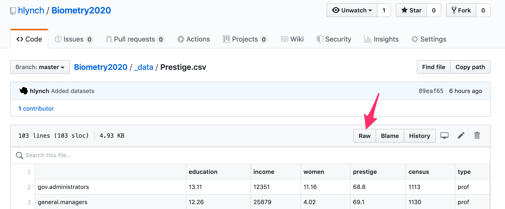

--- 
title: "Biometry Lecture and Lab Notes"
author: "Heather Lynch"
date: "2021-05-12"
site: bookdown::bookdown_site
documentclass: book
bibliography: [book.bib]
biblio-style: apalike
link-citations: yes
#github-repo: seankross/bookdown-start
#url: 'http\://seankross.com/bookdown-start/'
#description: "Everything you need (and nothing more) to start a bookdown book."
---

# Preface {-}

This eBook contains all of the lecture notes and lab exercises that we will do this semester in Biometry. While I have made every effort to cite sources where I've used "found" material, this eBook reflects my own personal notes drawn up over nearly a decade of work and some material may not properly identify the original sources used in drawing up my initial lecture notes. As I have moved this material into an online eBook, I have tried to better document material inspired by or drawn from other sources. If you find anything in these notes that is not properly cited or sourced, please let me know so it can be amended. Any mistakes are mine and mine alone.

*Data sets*

Here are the datasets used in this course. You can download the data set from the course GitHub page and then save it to your local directory. To do that, right-click or control-click on the "raw" button; this will allow you to download the file in its original format.

<div class="figure" style="text-align: center">

<p class="caption">(\#fig:unnamed-chunk-1)The dataset links take you here. The "raw" button allows you to download the file</p>
</div>

Another way to do it is to use the 'readr' package, as I demonstrate here for the clouds.csv dataset:


```r
library(readr)
clouds <- read_csv("https://raw.githubusercontent.com/hlynch/Biometry2021/master/_data/clouds.csv")
```

* `clouds` (csv): [link](https://github.com/hlynch/Biometry2021/tree/master/_data/clouds.csv) [1]
* `clouds` (txt): [link](https://github.com/hlynch/Biometry2021/tree/master/_data/clouds.txt) [1]
* `Prestige`: [link](https://github.com/hlynch/Biometry2021/tree/master/_data/Prestige.csv) [2]
* `skulls`: [link](https://github.com/hlynch/Biometry2021/tree/master/_data/skulls.txt) [3]
* `diabetes`: [link](https://github.com/hlynch/Biometry2021/tree/master/_data/diabetes.csv) [4]
* `WaterData`: [link](https://github.com/hlynch/Biometry2021/tree/master/_data/WaterData.csv)
* `FoxFurProduction`: [link](https://github.com/hlynch/Biometry2021/tree/master/_data/FoxFurProduction.csv)   
* `fish`: [link](https://github.com/hlynch/Biometry2021/tree/master/_data/fish.txt) 
* `Week-9-Data`: [link](https://github.com/hlynch/Biometry2021/tree/master/_data/Week-9-Data.txt) 
* `bomregions2012`: [link](https://github.com/hlynch/Biometry2021/tree/master/_data/bomregions2012.csv) 
* `Challenger_data`: [link](https://github.com/hlynch/Biometry2021/tree/master/_data/Challenger_data.csv) 
* `Challenger_data_fieldandnozzle`: [link](https://github.com/hlynch/Biometry2021/tree/master/_data/Challenger_data_fieldandnozzle.csv) 
* `Brogan_et_al_2013_Fig1Data`: [link](https://github.com/hlynch/Biometry2021/tree/master/_data/Brogan_et_al_2013_Fig1Data.xlsx) 
* `fruit_flies`: [link](https://github.com/hlynch/Biometry2021/tree/master/_data/fruit_flies.csv) 
* `medley`: [link](https://github.com/hlynch/Biometry2021/tree/master/_data/medley.csv) 
* `quinn`: [link](https://github.com/hlynch/Biometry2021/tree/master/_data/quinn.csv) 
* `TwoWayANOVAdata_balanced`: [link](https://github.com/hlynch/Biometry2021/tree/master/_data/TwoWayANOVAdata_balanced.csv) 
* `TwoWayANOVAdata`: [link](https://github.com/hlynch/Biometry2021/tree/master/_data/TwoWayANOVAdata.csv) 
* `TwoWayANOVAdata`: [link](https://github.com/hlynch/Biometry2021/tree/master/_data/TwoWayANOVAdata.csv) 
* `flatworms`: [link](https://github.com/hlynch/Biometry2021/tree/master/_data/flatworms.csv) 
* `flies`: [link](https://github.com/hlynch/Biometry2021/tree/master/_data/flies.txt) 
* `rats`: [link](https://github.com/hlynch/Biometry2021/tree/master/_data/rats.txt) 
* `tobacco`: [link](https://github.com/hlynch/Biometry2021/tree/master/_data/tobacco.csv) 
* `crabs`: [link](https://github.com/hlynch/Biometry2021/tree/master/_data/crabs.csv) 
* `frogs`: [link](https://github.com/hlynch/Biometry2021/tree/master/_data/frogs.csv) 
* `MammalLifeHistory`: [link](https://github.com/hlynch/Biometry2021/tree/master/_data/MammalLifeHistory.csv) 
* `Historic-lichen_data`: [link](https://github.com/hlynch/Biometry2021/tree/master/_data/Historic-lichen-data.xls) 
* `Lichen-sites-area`: [link](https://github.com/hlynch/Biometry2021/tree/master/_data/Lichen-sites-area.xls) 
* `Temperature_and_isolation`: [link](https://github.com/hlynch/Biometry2021/tree/master/_data/Temperature_and_isolation.xls) 
* `lovett2`: [link](https://github.com/hlynch/Biometry2021/tree/master/_data/lovett2.csv) 

[1] Source: Chambers, Cleveland, Kleiner, and Tukey. (1983). Graphical Methods for Data Analysis. Wadsworth International Group, Belmont, CA, 351. Original Source: Simpson, Alsen, and Eden. (1975). A Bayesian analysis of a multiplicative treatment effect in weather modification. Technometrics 17, 161-166.

[2] Fox, John, and Harvey Sanford Weisberg. 2011. An R Companion to Applied Regression. 2nd ed. Thousand Oaks, CA: Sage Publications.

[3] Thomson, A. and Randall-Maciver, R. (1905) Ancient Races of the Thebaid, Oxford: Oxford University Press. Also found in: Hand, D.J., et al. (1994) A Handbook of Small Data Sets, New York: Chapman & Hall, pp. 299-301. Manly, B.F.J. (1986) Multivariate Statistical Methods, New York: Chapman & Hall.

[4] Willems JP, Saunders JT, DE Hunt, JB Schorling: Prevalence of coronary heart disease risk factors among rural blacks: A community-based study. Southern Medical Journal 90:814-820; 1997 Schorling JB, Roach J, Siegel M, Baturka N, Hunt DE, Guterbock TM, Stewart HL: A trial of church-based smoking cessation interventions for rural African Americans. Preventive Medicine 26:92-101; 1997.

